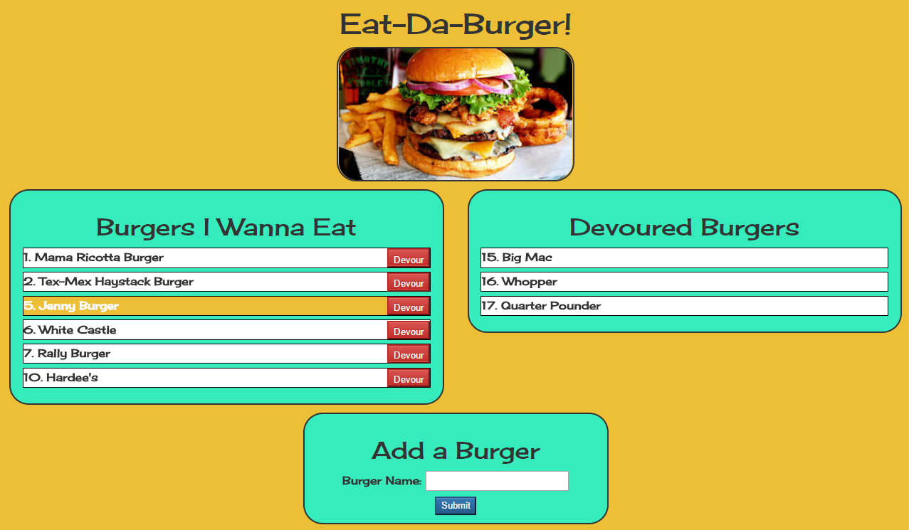

# Eat-Da-Burger

This project was homework for the UNCC Coding Boot Camp. The goal was to learn the concept of separation of concerns (MVC - Model, View, Controller) through the use of Node.js, Express, MySQL, Handlebars and a custom ORM. 

## Getting Started

Clone or download this repo to your local system. 

### Prerequisites

Both of these will need to be installed and running:

* Node.js
* MySQL 

### Installing

To load all required NPM packages, in your terminal window, navigate to the new folder and run  

```
npm install
```

Within the the db folder, you will find 'schema.sql' to create the database and table as well as 'seeds.sql' that contains a few sample records to get you started... if you like.

To start Express, in your terminal window run  

```
node server
```
## Running the tests

To use the app, open your browser and navigate to 

```
http://localhost:3000/index
```

You should see something like this:



Have fun!

## Built With

* [Node.js](https://nodejs.org/en/)
* [MySQL](https://www.mysql.com/pache.org/)
* [Handlebars](http://handlebarsjs.com/)
* [Express](https://expressjs.com/)

## Authors

* **Dan Phillips** - [dlphillips](https://github.com/dlphillips/)

## Acknowledgments

* [@darinboesch](https://github.com/darinboesch) & the TA's Chris Carter & Dave Jan

